<p align="center">
  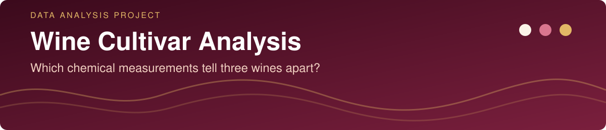
</p>

<p align="center">
  
  
  
  
</p>

<p align="center">
  <a href="#project-background">Background</a> ·
  <a href="#key-metrics">Key Metrics</a> ·
  <a href="#executive-summary">Executive Summary</a> ·
  <a href="#insights-deep-dive">Insights</a> ·
  <a href="#recommendations">Recommendations</a> ·
  <a href="#repository--how-to-run">How to Run</a>
</p>

> **In one sentence:** the chemical analysis of a wine is enough to recognise its cultivar **96-98% of the time**, against about 40% for a rule that always names the most frequent cultivar. Three measurements (flavanoids, proline and the OD280/OD315 ratio) do most of the work, and a **perfect score on one test set turned out to be mostly luck**.

<br>


Imagine a wine-quality laboratory that must verify the grape cultivar of the bottles it receives. Checking by hand is slow, so the lab wants to know whether the **chemical analysis it already runs** is enough to recognise the cultivar, and **which measurements matter most**.

The analysis uses the classic *Wine* dataset (UCI Machine Learning Repository, bundled with scikit-learn): 178 wines grown in the same region of Italy and derived from three cultivars, each described by 13 chemical measurements. The source data does not name the cultivars, so they appear here as *Cultivar 0, 1 and 2*.

**Questions this analysis answers**

1. Which measurements differ most between the three cultivars?
2. Can a simple model recognise the cultivar, and how does it compare with a naive rule?
3. How much does data preparation (scaling the measurements) matter?
4. How far can a single accuracy figure be trusted on a dataset this small?

<br>


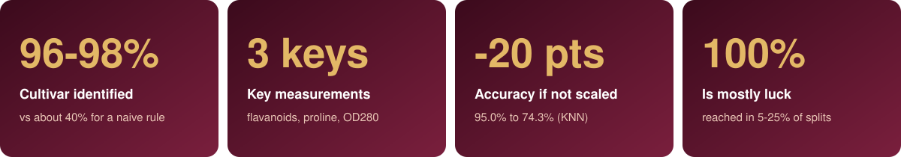

<br>


## Executive Summary

<p align="center">
  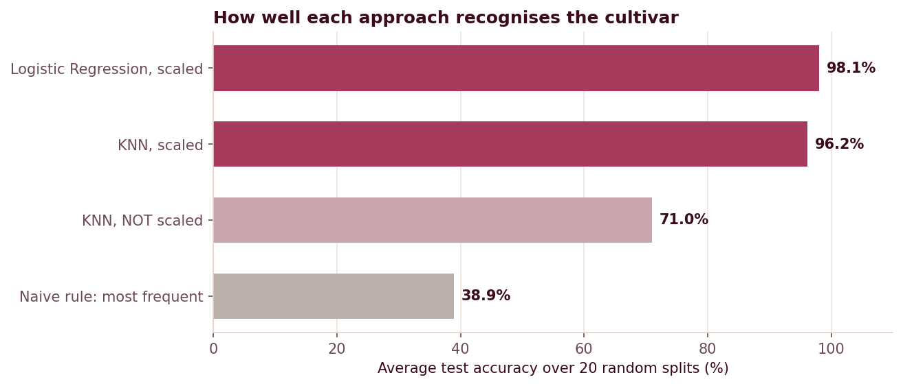
</p>

| Approach | Cross-validation accuracy (training set) | Accuracy on the 54 test wines | Average over 20 different splits |
|---|:---:|:---:|:---:|
| Naive rule: most frequent cultivar | 40.3% | 38.9% | 38.9% |
| KNN, measurements **not** scaled | 74.3% | 57.4% | 71.0% |
| KNN, scaled | 95.0% | none | 96.2% |
| KNN, scaled and tuned | 97.1% | **100%** | none |
| Logistic Regression, scaled | 98.2% | none | **98.1%** |
| Logistic Regression, scaled and tuned | 98.7% | 96.3% | none |

*"None" means the combination was not run: tuned models were evaluated once on the test set, and the 20-split comparison uses default settings.*

**What this means**

- **The cultivar can be recognised reliably.** Both models land at about 96-98%, far above the naive rule.
- **Preparing the data matters a lot.** The same KNN drops from 95.0% to 74.3% when the measurements are not scaled, because `proline` (values in the hundreds) drowns out measurements such as `hue` (around 1).
- **The 100% is not what it seems.** KNN scored 54 out of 54 on the original test set, but one wine is worth 1.9 points and the gap with Logistic Regression is two wines. Across 20 different splits Logistic Regression reaches 100% in 25% of them and KNN in only 5%.
- **Logistic Regression is the safer choice.** It is simple, as accurate as KNN or slightly better in every fair comparison, and much faster to tune (about 1 s against about 14 s on a single-core machine).

<br>


### 1. Each cultivar has its own chemical profile

| Measurement (average) | Cultivar 0 | Cultivar 1 | Cultivar 2 |
|---|:---:|:---:|:---:|
| Proline | **1,112** | 515 | 648 |
| Flavanoids | 2.91 | 2.09 | **0.76** |
| Alcohol | **13.7** | 12.3 | 13.2 |
| Colour intensity | 5.5 | **3.1** | 7.5 |
| OD280/OD315 ratio | 3.20 | 2.76 | **1.70** |
| Hue | 1.06 | 1.06 | **0.67** |

*Bold marks the value that stands out for that cultivar.* Cultivar 0 stands out for high proline, Cultivar 1 for low alcohol and colour, and Cultivar 2 for very low flavanoids and hue with the strongest colour.

### 2. Three measurements separate the cultivars best

<p align="center">
  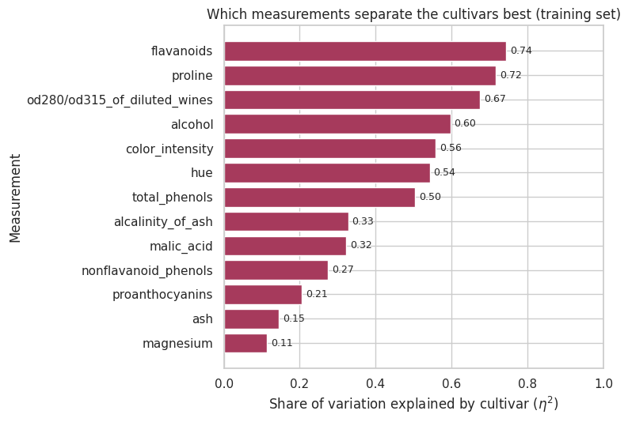
</p>

The chart shows how much of each measurement's variation is explained by the cultivar. **Flavanoids (0.74), proline (0.72) and the OD280/OD315 ratio (0.67)** lead, while `magnesium` (0.11) and `ash` (0.15) say very little about the cultivar.

<p align="center">
  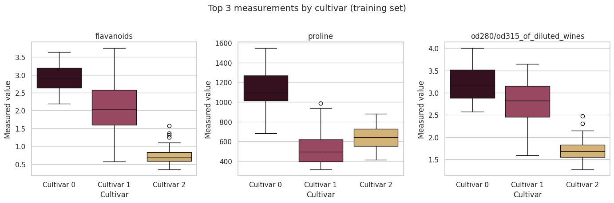
</p>

No single measurement is enough. Flavanoids isolate Cultivar 2, while proline isolates Cultivar 0 and blurs the other two. It is the **combination** that makes the cultivars recognisable. The [distributions of all 13 measurements](images/distributions_by_cultivar.png) are in the notebook and in the images folder.

### 3. Little redundancy, and few unusual wines

<p align="center">
  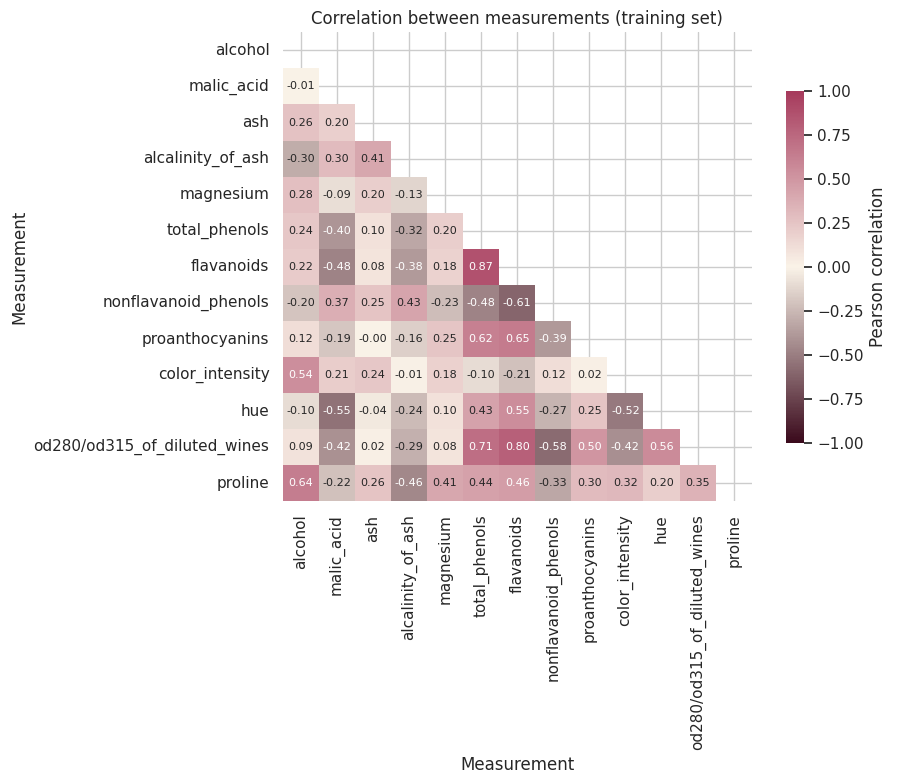
</p>

Only three pairs of measurements are strongly related (correlation of 0.7 or more), all linked to phenols: flavanoids with total phenols (0.87), OD280 with flavanoids (0.80) and OD280 with total phenols (0.71). Only 13 of the 124 training wines (10%) have an unusual value, mostly in `magnesium`. Nothing suggests measurement errors, so **no values were removed**.

### 4. Scaling the measurements is not optional

<p align="center">
  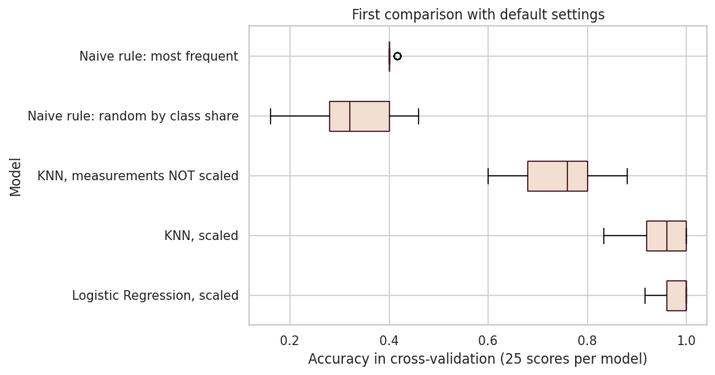
</p>

With default settings, every real model beats the naive rules by a wide margin. The unscaled KNN is the clear exception among them, about 20 points below its scaled version.

### 5. Fine-tuning barely changes the picture

<p align="center">
  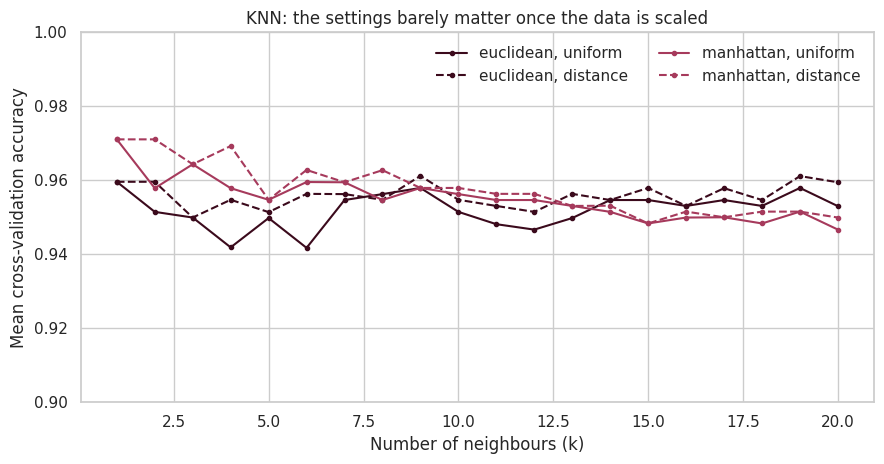
</p>

The search picked KNN with one neighbour and Manhattan distance, but only 3 of the 80 settings tie for the best score and 10 are within one percentage point of it. Differences this small are smaller than the normal fold-to-fold variation, so the specific "best" settings should not be over-interpreted.

### 6. A single test score can mislead

<p align="center">
  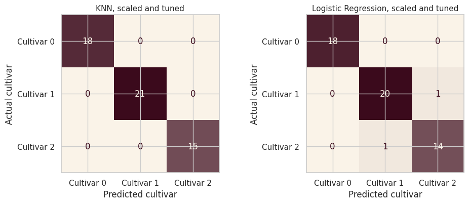
</p>

<p align="center">
  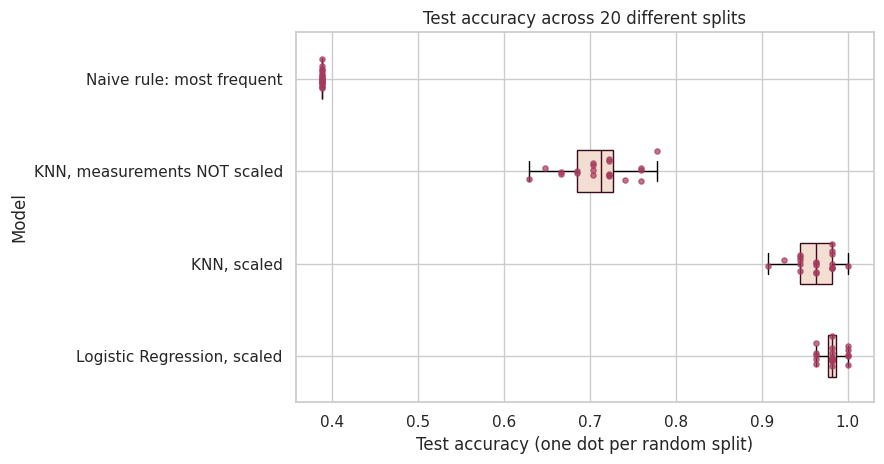
</p>

On the original test set KNN got every wine right and Logistic Regression missed two. Repeating the comparison on **20 different splits** shows that a realistic expectation is **96-98%** for the scaled models, with Logistic Regression slightly higher and steadier (spread of 1.3 points against 2.3 for KNN).

<details>
<summary><b>How the analysis was built (technical details)</b></summary>

<br>

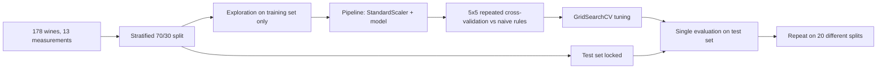

- **No data leakage:** the test set is set aside before any exploration, and scaling sits inside a `Pipeline` so each cross-validation fold fits its own scaler.
- **Metrics:** accuracy (classes are balanced, roughly 40% / 33% / 27%) with macro-F1 as a check.
- **Reference points:** two `DummyClassifier` strategies (most frequent class, random by class share).
- **Variation explained by cultivar:** $\eta^2 = SS_{between} / SS_{total}$, used instead of a Pearson correlation with the class label, which has no meaning for a category.
- **Reproducibility:** fixed seed (`RANDOM_STATE = 2718`); the 20-split analysis uses seeds 100-119.
- **Data:** `sklearn.datasets.load_wine`, no file to download.

</details>

<br>


1. **Use a simple model as a first-pass check, not as the final word.** A scaled Logistic Regression is accurate, fast and easy to explain to non-technical colleagues.
2. **Always scale the measurements** before using any distance-based method, and report a **range** (96-98%) instead of a single score.
3. **Test a lighter set of measurements.** Since flavanoids, proline and the OD280/OD315 ratio carry most of the signal, check whether a model using only them keeps its accuracy. That would make the analysis cheaper to run.
4. **Validate on new wines** from other years, regions or laboratories before relying on the model in practice.


## Repository & How to Run

```
Wine_Cultivar_Analysis/
├── notebooks/
│   └── Wine_Cultivar_Analysis.ipynb   # full analysis, executed, with outputs
├── images/                            # figures and graphics used in this README
├── requirements.txt
├── LICENSE
└── README.md
```

```bash
git clone https://github.com/AlessandroCucchi/Wine_Cultivar_Analysis.git
cd wine-cultivar-analysis

python -m venv .venv
source .venv/bin/activate          # Windows: .venv\Scripts\activate
pip install -r requirements.txt

jupyter notebook notebooks/Wine_Cultivar_Analysis.ipynb
```


## About the Author

**Alessandro Cucchi**

[](https://www.linkedin.com/in/alessandrocucchi-)
[](https://github.com/AlessandroCucchi)
